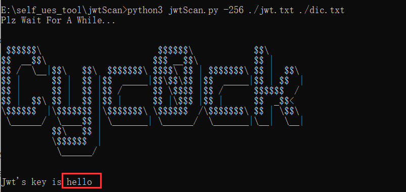

# jwtScan

jwtScan 是一款开源的 JWT 弱口令扫描工具，需要在 python3 的环境下运行，能对提供的 jwt_token 进行自动化扫描

# 参数

jwt 一共需要提供三个参数，分别是 加解密算法、需要爆破的 jwt_token 以及 爆破所需字典，三个参数需要按顺序给予

## 加解密算法

目前仅支持三种加密算法的暴力破解，具体参数如下

| 参数 |   意义    |
| :--: | :-------: |
| -256 | HS256加密 |
| -384 | HS384加密 |
| -512 | HS512加密 |

## jwt_token

jwt_token支持两种形式进行传参，即 txt文件 传参以及 字符串传参

# 测试

